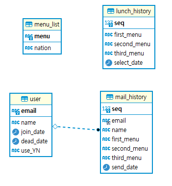

### 기술 스택 
1. Java 19.0.1
2. Spring Boot 2.5.4
3. Spring Data JPA
4. Thymeleaf
5. Bootstrap ( CSS Template )
6. MySQL 8.0

### 프로젝트 간단 설명
* 재직 시절 항상 고민해야 하던 점심 메뉴 문제를 고민하기 싫어 만든 랜덤 점심 메뉴 선택 프로그램
* Spring Data JPA 사용하여 기본적인 CRUD 기능 구현. &rarr;  Delete 기능은 Table의 use_YN Column 사용하여 신청하였는 지 마킹.
* email과 이름으로 신청 시 매주 주중 9.am 에 추천 메뉴 3가지를 선정하여 메일로 발송해줌.

### DB ERD

 

	

***
